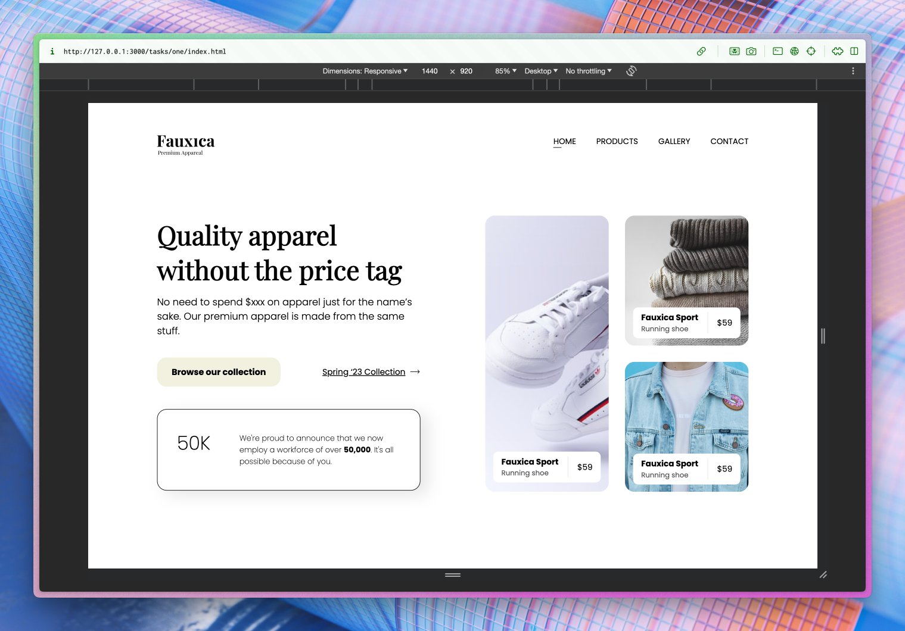

# Tugas Level 1

Bismillah,

Berikut submisi tugas implementasi desain website ana:

## Poin acceptance criteria

- [x] Ikuti desain yang telah disediakan di Figma.
- [x] Gunakan aset yang telah disediakan di Google Drive.
- [x] Tambahkan font "Playfair Display" dan "Poppins".
- [x] Hindari penggunaan property CSS position.
- [x] Source code terdiri dari HTML dan CSS saja.

## Hasil pengerjaan

- [Live preview](https://snbxhsiid.yusoofsh.id/672f55c2cb10d25d83078cc24860b783ae5302e7/tasks/one)
- [Source code](https://gitlab.com/yusoofsh/snbxhsiid/-/tree/672f55c2cb10d25d83078cc24860b783ae5302e7/tasks/one)

---

Sekian. Jazaakallaahu khairan katsiran.
