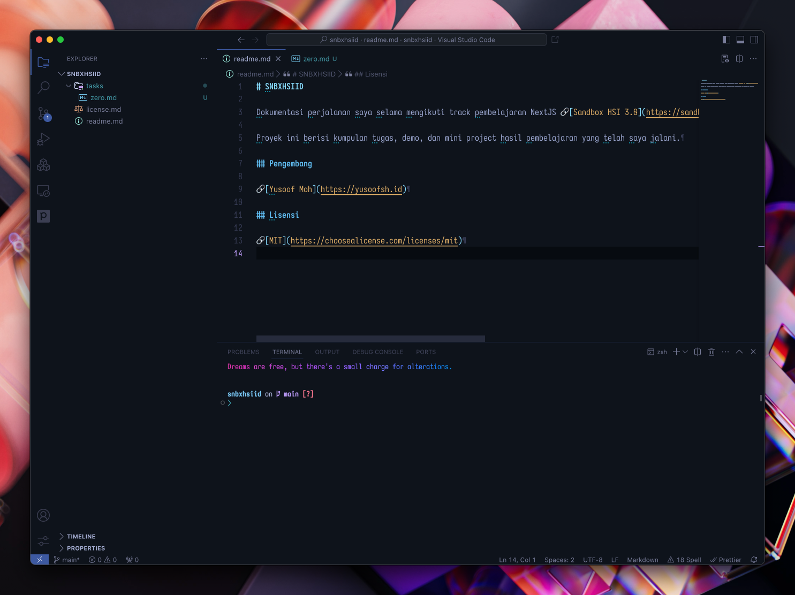

# Tugas Level 0

Bismillah,

Berikut adalah submisi 2 tugas yang telah ana selesaikan pada level 0:

## Pembuatan akun GitLab dan push repository

Ana telah membuat akun GitLab dengan username `yusoofsh`. Kemudian ana membuat repository baru bernama `snbxhsiid`.

Didalam repo tersebut, ana menambahkan sebuah file [readme](../readme.md) sederhana, juga [license](../license.md).
Lalu melakukan inisialisasi repo Git, commit perubahan, dan push ke GitLab.

Hasilnya, repository ini dapat diakses di: https://gitlab.com/yusoofsh/snbxhsiid

## Instalasi code editor (Visual Studio Code)

Terlampir tampilan dari aplikasi Visual Studio Code yang telah ana install:

---

Sekian. Jazaakallaahu khairan katsiran.
